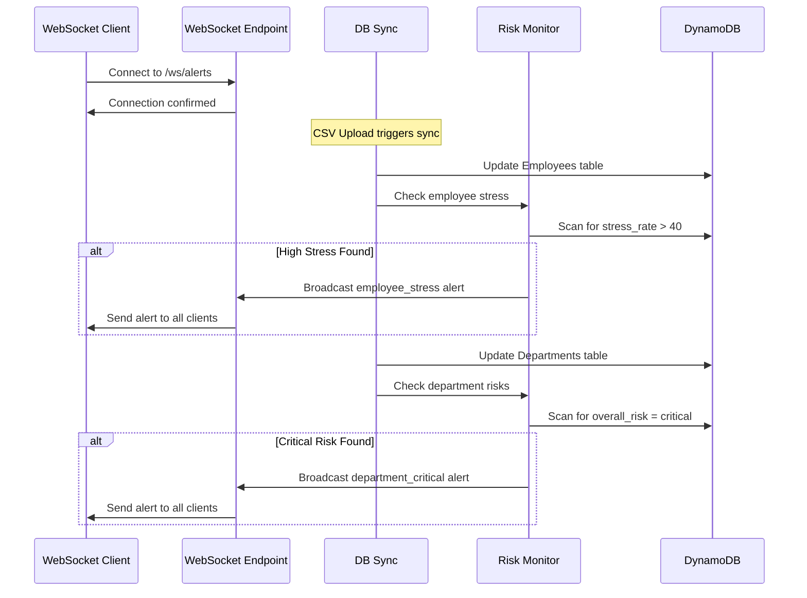

# WebSocket Real-Time Risk Monitoring - Usage Guide

## Overview

The WebSocket system monitors and broadcasts real-time alerts when:
1. **Department overall_risk** becomes "critical"
2. **Employee stress_rate** exceeds 40

## Architecture

### Components

1. **WebSocket Endpoint** (`api/v1/routes/websocket_alerts.py`)
   - Endpoint: `ws://localhost:8000/api/v1/ws/alerts`
   - Manages client connections
   - Broadcasts alerts to all connected clients

2. **Risk Monitor** (`utils/risk_monitor.py`)
   - Scans DynamoDB for risk thresholds
   - Tracks alert state to prevent duplicates
   - Sends alerts via WebSocket

3. **DB Sync Integration** (`utils/db_sync.py`)
   - Triggers monitoring after data updates
   - Checks employee stress after Employee table sync
   - Checks department risk after Department table sync

## How It Works



## Alert Message Format

### Department Critical Alert
```json
{
  "type": "department_critical",
  "timestamp": "2025-12-10T09:53:23+08:00",
  "data": {
    "department_id": "dept-123",
    "department_name": "Engineering",
    "overall_risk": "critical",
    "engagement_score": 45.5
  }
}
```

### Employee Stress Alert
```json
{
  "type": "employee_stress",
  "timestamp": "2025-12-10T09:53:23+08:00",
  "data": {
    "employee_id": "EMP001",
    "employee_name": "John Doe",
    "department": "Engineering",
    "position": "Software Engineer",
    "stress_rate": 65.5,
    "engagement_rate": 42.0,
    "attrition_rate": 55.0
  }
}
```

## Testing

### Option 1: Browser Test Client

1. Open `test_websocket.html` in your browser
2. Click "Connect" to establish WebSocket connection
3. Monitor real-time alerts as they appear

**Features:**
- Visual alert display with color coding
- Auto-reconnect functionality
- Ping/pong keep-alive
- Clear alerts button

### Option 2: Python Test Client

```bash
# Run the Python test client
python test_websocket_client.py
```

**Features:**
- Console-based alert monitoring
- Formatted output for different alert types
- Automatic ping to keep connection alive

### Option 3: Custom Integration

**JavaScript Example:**
```javascript
const ws = new WebSocket('ws://localhost:8000/api/v1/ws/alerts');

ws.onopen = () => {
  console.log('Connected to risk alerts');
};

ws.onmessage = (event) => {
  const alert = JSON.parse(event.data);
  
  if (alert.type === 'department_critical') {
    console.log('🚨 Critical Department:', alert.data.department_name);
    // Handle department alert
  } else if (alert.type === 'employee_stress') {
    console.log('😰 High Stress Employee:', alert.data.employee_id);
    // Handle employee alert
  }
};

ws.onerror = (error) => {
  console.error('WebSocket error:', error);
};

ws.onclose = () => {
  console.log('Disconnected');
};
```

**Python Example:**
```python
import asyncio
import websockets
import json

async def monitor_alerts():
    uri = "ws://localhost:8000/api/v1/ws/alerts"
    
    async with websockets.connect(uri) as websocket:
        async for message in websocket:
            alert = json.loads(message)
            
            if alert['type'] == 'department_critical':
                print(f"Critical dept: {alert['data']['department_name']}")
            elif alert['type'] == 'employee_stress':
                print(f"High stress: {alert['data']['employee_id']}")

asyncio.run(monitor_alerts())
```

## Triggering Alerts

Alerts are automatically triggered when:

1. **CSV Upload**: Upload survey data via `/api/v1/upload`
   - System processes data and updates DynamoDB
   - `perform_full_sync()` triggers risk monitoring
   - Alerts sent if thresholds exceeded

2. **Manual Testing**: Directly modify DynamoDB
   ```python
   # Set employee stress_rate > 40
   # Set department overall_risk = "critical"
   # Trigger sync or wait for next data upload
   ```

## State Management

The system tracks which alerts have been sent to prevent duplicates:

- **Employee Stress**: Tracked by `employee_id`
  - Alert sent when stress_rate crosses above 40
  - Alert cleared when stress_rate drops to ≤ 40

- **Department Risk**: Tracked by `department_id`
  - Alert sent when overall_risk becomes "critical"
  - Alert cleared when risk level changes from "critical"

## Troubleshooting

### Connection Issues

**Problem**: Cannot connect to WebSocket
```
❌ Connection refused
```

**Solution**: Ensure FastAPI server is running
```bash
cd backend
uvicorn main:app --reload
```

### No Alerts Received

**Problem**: Connected but no alerts appear

**Checklist**:
1. ✅ Is data being uploaded/synced?
2. ✅ Are there employees with stress_rate > 40?
3. ✅ Are there departments with overall_risk = "critical"?
4. ✅ Check server console for monitoring logs

**Debug**: Check server logs for:
```
Step 2.5: Checking employee stress levels...
🚨 ALERT: Employee EMP001 has high stress rate: 65.5
```

### Duplicate Alerts

**Problem**: Same alert sent multiple times

**Solution**: The system tracks alert state automatically. If duplicates occur, reset state:
```python
from utils.risk_monitor import reset_alert_state
reset_alert_state()
```

## API Documentation

Access interactive API docs at:
- Swagger UI: `http://localhost:8000/docs`
- ReDoc: `http://localhost:8000/redoc`

The WebSocket endpoint will be listed under the "WebSocket" tag.

## Production Considerations

### Scaling

For production deployments with multiple server instances:

1. **Use Redis for state tracking** (instead of in-memory sets)
2. **Implement WebSocket load balancing** (e.g., Socket.IO with Redis adapter)
3. **Add authentication** to WebSocket connections
4. **Rate limiting** to prevent alert flooding

### Monitoring

Track these metrics:
- Active WebSocket connections
- Alerts sent per minute
- Connection errors
- Average connection duration

### Security

Recommended enhancements:
- Add JWT authentication for WebSocket connections
- Implement role-based access (who can receive which alerts)
- Use WSS (WebSocket Secure) in production
- Add rate limiting per client

## Example Use Cases

### 1. Real-Time Dashboard
Display live risk alerts on a monitoring dashboard

### 2. Slack/Teams Integration
Forward alerts to team communication channels

### 3. Email Notifications
Trigger email alerts when critical risks detected

### 4. Mobile Push Notifications
Send push notifications to HR managers' mobile devices

### 5. Automated Interventions
Trigger automated workflows when alerts received
